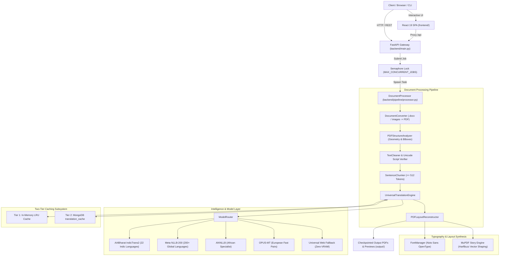

# Nexus: Technical Architecture & Engineering Master Documentation
> **Document Type:** Senior Software Engineer Architectural Specification & Interview Defense Guide  
> **System Name:** Nexus (Offline Multilingual PDF Translation & Vector Layout Reconstruction Engine)  
> **Author/Maintainer:** Senior Software Engineering Team  
> **Date:** October 2026  
> **Version:** 1.0.0-Enterprise  

---

## Table of Contents (Index)

1. [Executive Summary & Core Problem Statement](#1-executive-summary--core-problem-statement)
2. [High-Level Architecture & System Design](#2-high-level-architecture--system-design)
   - [2.1 Architectural Diagram](#21-architectural-diagram)
   - [2.2 Design Patterns Employed](#22-design-patterns-employed)
   - [2.3 Concurrency & Process Isolation Model](#23-concurrency--process-isolation-model)
3. [Deep-Dive: End-to-End Processing Pipeline](#3-deep-dive-end-to-end-processing-pipeline)
   - [3.1 Phase 1: Ingestion & Document Conversion](#31-phase-1-ingestion--document-conversion)
   - [3.2 Phase 2: Structural Document Analysis & Geometry Extraction](#32-phase-2-structural-document-analysis--geometry-extraction)
   - [3.3 Phase 3: OCR Fallback & Pre-Translation Text Normalization](#33-phase-3-ocr-fallback--pre-translation-text-normalization)
   - [3.4 Phase 4: Sentence-Aware Chunking (≤ 512 Tokens)](#34-phase-4-sentence-aware-chunking--512-tokens)
   - [3.5 Phase 5: Batched Neural Translation & Intelligent Routing](#35-phase-5-batched-neural-translation--intelligent-routing)
   - [3.6 Phase 6: Vector Layout Reconstruction & HarfBuzz OpenType Shaping](#36-phase-6-vector-layout-reconstruction--harfbuzz-opentype-shaping)
   - [3.7 Phase 7: Real-time Previews, Checkpointing & Final Synthesis](#37-phase-7-real-time-previews-checkpointing--final-synthesis)
4. [Machine Learning & Model Subsystem](#4-machine-learning--model-subsystem)
   - [4.1 Model Matrix (IndicTrans2, NLLB-200, AfriNLLB, OPUS-MT)](#41-model-matrix-indictrans2-nllb-200-afrinllb-opus-mt)
   - [4.2 Intelligent Router Decision Engine](#42-intelligent-router-decision-engine)
   - [4.3 VRAM Safety, LRU Offloading & Dynamic Batch Halving](#43-vram-safety-lru-offloading--dynamic-batch-halving)
   - [4.4 Pivot Translation (Indic ↔ English ↔ Indic)](#44-pivot-translation-indic--english--indic)
5. [Typography & Vector Layout Reconstruction](#5-typography--vector-layout-reconstruction)
   - [5.1 Why Naive PDF Renderers Fail for Indic Scripts](#51-why-naive-pdf-renderers-fail-for-indic-scripts)
   - [5.2 HarfBuzz OpenType Complex-Script Shaping Engine](#52-harfbuzz-opentype-complex-script-shaping-engine)
   - [5.3 Non-Destructive Vector Redaction (Image Preservation)](#53-non-destructive-vector-redaction-image-preservation)
   - [5.4 Dynamic Font Fitting & Downward Whitespace BBox Expansion](#54-dynamic-font-fitting--downward-whitespace-bbox-expansion)
6. [Data Architecture, Two-Tier Caching & Persistence](#6-data-architecture-two-tier-caching--persistence)
   - [6.1 Two-Tier Cache Architecture](#61-two-tier-cache-architecture)
   - [6.2 Cryptographic Key Hashing](#62-cryptographic-key-hashing)
   - [6.3 MongoDB Schemas & Index Strategy](#63-mongodb-schemas--index-strategy)
   - [6.4 Ephemeral Guest Sessions & ContextVars](#64-ephemeral-guest-sessions--contextvars)
   - [6.5 Filesystem Hierarchy](#65-filesystem-hierarchy)
7. [API Design & Interface Contracts](#7-api-design--interface-contracts)
8. [Frontend System Architecture (React 19 + Vite)](#8-frontend-system-architecture-react-19--vite)
9. [DevOps, Self-Healing Automation & Production Readiness](#9-devops-self-healing-automation--production-readiness)
10. [Senior Interview Defense Guide & Architectural FAQs](#10-senior-interview-defense-guide--architectural-faqs)

---

## 1. Executive Summary & Core Problem Statement

### 1.1 Executive Summary
**Nexus** is an enterprise-grade, offline-first document understanding, machine translation, and vector layout reconstruction engine. It translates high-complexity multi-page publications, academic papers, and books from English or global languages into **22 Scheduled Indian languages** (and vice versa), as well as **200+ global languages**, while strictly preserving visual geometry, typography, tables, raster artwork, vector borders, and reading order.

### 1.2 The Hard Engineering Challenges Solved
1. **The PDF Format is Non-Linear:** Unlike HTML or DOCX, a PDF has no native concept of "words", "sentences", "paragraphs", or "flows". It is merely a flat display canvas containing draw-string commands with arbitrary `(x, y)` Cartesian coordinates. Reconstructing reading order and paragraph continuity without overlapping requires sophisticated spatial heuristics.
2. **Indic Complex Script Shaping Failure:** Indic scripts (Devanagari, Gujarati, Tamil, Telugu, Bengali, Kannada, etc.) rely on complex glyph substitution, consonant conjuncts (`ક્ષ`, `જ્ઞ`, `ત્ર`, `દ્વ`), and non-linear vowel matras (`િ`, `ી`, `ુ`, `ૂ`). Standard PDF generation tools (ReportLab, FPDF, naive PyMuPDF `insert_text`) render these as broken individual unicode codepoints. Nexus solves this by embedding **HarfBuzz via MuPDF's Story Layout Engine**.
3. **The 30–60% Text Expansion Paradox:** Indic translations require 30% to 60% more spatial length than English source sentences. Naive translation causes text to collide with adjacent images, overflow bounding boxes, or overlap subsequent lines. Nexus implements an iterative binary-search font scaler combined with downward whitespace bounding box expansion.
4. **Offline Neural Inference on Constrained Hardware:** Running state-of-the-art 1B+ parameter models locally on consumer workstations (4GB–8GB VRAM) frequently causes CUDA Out-Of-Memory (OOM) crashes. Nexus provides dynamic batch halving, single-model LRU VRAM swapping, and a two-tier sub-millisecond cache.

---

## 2. High-Level Architecture & System Design

### 2.1 Architectural Diagram



### 2.2 Design Patterns Employed
* **Pipes-and-Filters (Pipeline Pattern):** Each stage (Analyze $\rightarrow$ Clean $\rightarrow$ Chunk $\rightarrow$ Translate $\rightarrow$ Reconstruct) operates as an independent filter with strict contract boundaries, enabling isolated unit testing.
* **Strategy Pattern:** The translation engine defines a unified `BaseTranslationBackend` interface. Specific models (`IndicTrans2Backend`, `NLLBBackend`, `AfriNLLBBackend`, `OpusBackend`) plug into the engine without modifying inference dispatch.
* **Two-Tier Cache Pattern:** Combines process-local microsecond memory lookups with persistent distributed database caching.
* **Circuit Breaker / Fallback Pattern:** If MongoDB fails, the system seamlessly redirects writes and reads to Python process RAM (`_memory_jobs`), ensuring zero downtime. If a GPU runs out of VRAM, batch size automatically cuts in half and re-evaluates.
* **Singleton Pattern:** Used for database connections (`MongoDBManager._instance`), model cache coordinators, and OCR engine instances to prevent redundant allocations.

### 2.3 Concurrency & Process Isolation Model
* **API Worker:** FastAPI running on Uvicorn handles async I/O.
* **Job Execution:** Non-blocking processing handled via FastAPI's `BackgroundTasks`.
* **Hardware Protection Throttling:** `PIPELINE_SEMAPHORE = threading.Semaphore(MAX_CONCURRENT_JOBS)` guarantees that heavy neural inference pipelines do not compete for GPU memory simultaneously.
* **Thread-Local State:** `contextvars.ContextVar("guest_context_var")` isolates guest sessions, guaranteeing guest document contents are never leaked or committed to persistent database collections.

---

## 3. Deep-Dive: End-to-End Processing Pipeline

### 3.1 Phase 1: Ingestion & Document Conversion
* **File:** [`backend/pipeline/doc_converter.py`](file:///c:/Users/sangh/Downloads/to%20desktop/nexus/backend/pipeline/doc_converter.py)
* **Function:** Accepts `.pdf`, `.docx`, `.jpg`, `.jpeg`, `.png`, `.bmp`, `.tiff`.
* **Mechanism:** Converts non-PDF documents into standard vector PDFs using PyMuPDF and Pillow. Maintains resolution while structuring document canvases into standardized page dimensions.

### 3.2 Phase 2: Structural Document Analysis & Geometry Extraction
* **File:** [`backend/pipeline/analyzer.py`](file:///c:/Users/sangh/Downloads/to%20desktop/nexus/backend/pipeline/analyzer.py)
* **Class:** `PDFStructureAnalyzer`
* **Core Responsibilities:**
  1. **Bounding Box Extraction:** Iterates through `page.get_text("blocks")` and `page.get_text("words")` to extract exact coordinates `[x0, y0, x1, y1]`, font size, font family, color, and flags (bold, italic).
  2. **Semantic Header/Footer Separation:** Distinguishes between document body content and running headers, footers, or page numbers (based on margin heuristics: top 5% and bottom 5% of page height). Headers and footers are preserved to prevent pagination corruption.
  3. **Table & Cell Matrix Detection:** Calls `page.find_tables()` to identify row/column boundaries and cell rects. This guarantees cell content is translated without violating table borders.
  4. **Scanned Page Heuristic:** Checks if the character count is $< 50$ while an embedded raster image covers $> 40\%$ of the page area. If true, the page is flagged for OCR.

### 3.3 Phase 3: OCR Fallback & Pre-Translation Text Normalization
* **Files:** [`backend/pipeline/cleaner.py`](file:///c:/Users/sangh/Downloads/to%20desktop/nexus/backend/pipeline/cleaner.py) & [`backend/pipeline/ocr.py`](file:///c:/Users/sangh/Downloads/to%20desktop/nexus/backend/pipeline/ocr.py)
* **Scanned Page Pipeline:** 
  * Rasterizes the page at 300 DPI.
  * Dispatches to **PaddleOCR** (primary) or **PyTesseract** (fallback).
  * Synthesizes native-like text blocks with exact bounding box rects.
* **Paragraph Consolidation:** PDFs break single sentences into separate spans at line breaks. The processor consolidates contiguous lines within the same vertical column into unified paragraphs.
* **Text Normalizer (`clean_ocr_text`):**
  * Removes archaic OCR font artifacts (e.g. Georgian font substitution anomalies).
  * Strips soft-hyphens (`\u00ad`) and reconnects broken line-break words (e.g. `inter-\nview` $\rightarrow$ `interview`).
  * Normalizes Indic script zero-width joiners (`ZWJ` / `ZWNJ`).
* **Source Script Verification:** Inspects character Unicode ranges. If a user sets the source language to English but the document contains Devanagari text, the pipeline flags a warning and auto-adjusts routing.

### 3.4 Phase 4: Sentence-Aware Chunking (≤ 512 Tokens)
* **File:** [`backend/translation/chunker.py`](file:///c:/Users/sangh/Downloads/to%20desktop/nexus/backend/translation/chunker.py)
* **Class:** `SentenceChunker`
* **Why it matters:** Transformer attention models degrade rapidly and hallucinate when fed inputs exceeding their maximum context window (512 tokens).
* **Algorithm:**
  1. Splits input text using regex sentence boundaries (`.`, `?`, `!`, `।`, `\n\n`).
  2. Measures token length using the active tokenizer (`sentencepiece` / `transformers`).
  3. Groups consecutive sentences into chunks strictly $\le 512$ tokens without ever cutting a sentence in half.

### 3.5 Phase 5: Batched Neural Translation & Intelligent Routing
* **Files:** [`backend/translation/engine.py`](file:///c:/Users/sangh/Downloads/to%20desktop/nexus/backend/translation/engine.py) & [`backend/translation/router.py`](file:///c:/Users/sangh/Downloads/to%20desktop/nexus/backend/translation/router.py)
* **Batch Windowing:** Collects all translatable blocks across a multi-page window (default: 4 pages) into a unified translation batch.
* **Two-Tier Cache Interception:** Each sentence is hashed. If found in Tier 1 (RAM) or Tier 2 (MongoDB), the cached translation is returned in $<1$ ms.
* **Tensor Inference:** Uncached sentences are padded into GPU tensor batches (default batch size: 8) and executed using FP16 precision (`torch.cuda.amp`).
* **Dynamic Batch Halving:** If a CUDA memory allocation triggers `torch.cuda.OutOfMemoryError`, the engine intercepts the exception, calls `torch.cuda.empty_cache()`, halves the batch size (e.g. $8 \rightarrow 4 \rightarrow 2$), and re-executes.
* **Persistence:** Newly translated strings are simultaneously populated into the in-memory LRU cache and written to MongoDB.

### 3.6 Phase 6: Vector Layout Reconstruction & HarfBuzz OpenType Shaping
* **File:** [`backend/pipeline/layout.py`](file:///c:/Users/sangh/Downloads/to%20desktop/nexus/backend/pipeline/layout.py)
* **Class:** `PDFLayoutReconstructor`
* **Step A: Non-Destructive Vector Redaction:**
  * Iterates over all source text bounding boxes.
  * Adds redaction annotations: `page.add_redact_annot(rect, fill=(1, 1, 1))`.
  * Calls `page.apply_redactions(images=pymupdf.PDF_REDACT_IMAGE_NONE)`.
  * **Result:** Erases original text while 100% preserving embedded bitmap illustrations, backgrounds, and vector lines.
* **Step B: HarfBuzz Complex-Script Shaping (MuPDF Story):**
  * Generates an HTML/CSS layout specification containing the translated text, font family, line height, and text alignment.
  * Feeds the payload to `pymupdf.Story(html=..., user_css=..., archive=SHARED_ARCHIVE)`.
  * HarfBuzz executes OpenType glyph layout: calculates consonant conjuncts, ligature substitutions, and vowel matra placements.
* **Step C: Downward Whitespace Growth & Dynamic Font Fitting:**
  * Checks if the translated text fits inside the original bounding box.
  * Iteratively scales font size down (up to an 85% clamp).
  * If still overflowing, the reconstructor expands the bounding box downward into detected empty whitespace, preventing text clipping.

### 3.7 Phase 7: Real-time Previews, Checkpointing & Final Synthesis
* **Real-time Previews:** Renders 150 DPI PNG preview images for both original and translated pages (`page_{N}_orig.png`, `page_{N}_rendered.png`).
* **Interactive Metadata JSON:** Exports percentage-based bounding box coordinates (`page_{N}_data.json`) for the split-view frontend viewer.
* **Incremental Checkpointing:** Flushes the translated PDF to disk every 5 pages. If a 300-page book job crashes on page 290, progress is not lost.
* **Final Assembly:** Saves the completed, fully-reconstructed document to [`output/`](file:///c:/Users/sangh/Downloads/to%20desktop/nexus/output/).

---

## 4. Machine Learning & Model Subsystem

### 4.1 Model Matrix (IndicTrans2, NLLB-200, AfriNLLB, OPUS-MT)

| Model Family | Developer | Architecture | Parameter Tiers | Scope / Language Coverage |
| :--- | :--- | :--- | :--- | :--- |
| **IndicTrans2** | AI4Bharat (IIT Madras) | Seq2Seq Transformer (IndicBART / mBART backbone) | • **1B (Best):** State-of-the-art literature quality<br>• **200M/320M (Compact):** Consumer GPU / 4GB VRAM | **All 22 Scheduled Indian Languages:** Assamese, Bengali, Bodo, Dogri, Gujarati, Hindi, Kannada, Kashmiri, Konkani, Maithili, Malayalam, Manipuri, Marathi, Nepali, Odia, Punjabi, Sanskrit, Santali, Sindhi, Tamil, Telugu, Urdu + English. |
| **NLLB-200** | Meta AI | Sparse MoE / Dense Transformer | • **1.3B (Best):** High general translation accuracy<br>• **600M (Compact):** Fast multi-language inference | **Universal Safety Net:** 200+ global languages using FLORES-200 tags (e.g. Spanish, German, French, Chinese, Japanese, Arabic, Russian). |
| **AfriNLLB** | AfriNLP | Knowledge-Distilled Multilingual Seq2Seq | • **12enc-12dec full (Best)**<br>• **481M iterative (Compact)** | **African Languages Specialist:** Swahili, Yoruba, Amharic, Hausa, Zulu, Somali, Lingala, Wolof, Afrikaans. Uses M2M-100 tokenizer codes. |
| **OPUS-MT** | Helsinki-NLP | MarianMT Seq2Seq | ~75M per pair | **European Language-Pair Specialists:** Benchmarked fast pairs (`en-es`, `en-fr`, `en-de`, `en-ru`, `en-it`, `en-nl`). |
| **Web Universal** | Nexus Internal | Zero-VRAM Lightweight Adapter | Zero local parameters | **Emergency Fallback:** Zero-RAM / Zero-VRAM alternative for global languages if 5.5GB local weights are not installed. |

### 4.2 Intelligent Router Decision Engine
Located in [`backend/translation/router.py`](file:///c:/Users/sangh/Downloads/to%20desktop/nexus/backend/translation/router.py):
1. **Normalization:** Converts input codes (e.g., `"gu"`, `"guj"`, `"gujarati"`, `"GU"`) to normalized FLORES tags (`guj_Gujr`).
2. **Indic Routing:** If either source or target is an Indian language, it routes to **IndicTrans2**.
3. **African Routing:** If language belongs to AfriNLLB published directions, it routes to **AfriNLLB**.
4. **Benchmarked OPUS Routing:** If a pair is registered in `BENCHMARKED_OPUS_MT_PAIRS` and model weights exist on disk, it routes to **OPUS-MT**.
5. **Universal Fallback:** All remaining pairs default to **NLLB-200** (or Web Universal if uninstalled).

### 4.3 VRAM Safety, LRU Offloading & Dynamic Batch Halving
* **Single Model In VRAM (`MAX_LOADED_MODELS=1`):** Large language models consume 2.5GB to 5.5GB VRAM. Nexus retains only one active model in GPU memory. When the router switches from IndicTrans2 to NLLB, the previous model is deallocated, garbage collected, and `torch.cuda.empty_cache()` is called.
* **Inference Precision:** Automatically detects CUDA availability. Runs `torch.float16` on GPUs and `torch.float32` on CPUs.
* **Adaptive Batch Halving:** Batches start at 8 sentences. If a CUDA memory spike occurs, the batch is divided in half and retried automatically.

### 4.4 Pivot Translation (Indic ↔ English ↔ Indic)
Controlled by `INDIC_PIVOT_VIA_ENGLISH`:
* When direct Indic $\leftrightarrow$ Indic weights (1B) are present on disk, Nexus executes direct translation (e.g., Gujarati $\rightarrow$ Hindi in one pass).
* If the direct model is absent, the router automatically pivots: $\text{Gujarati} \rightarrow \text{English} \rightarrow \text{Hindi}$, avoiding pipeline halts.

---

## 5. Typography & Vector Layout Reconstruction

### 5.1 Why Naive PDF Renderers Fail for Indic Scripts
Standard PDF libraries treat text as isolated ASCII/Unicode glyphs placed sequentially from left to right. This completely breaks Indic scripts:
1. **Consonant Conjuncts (*Samyuktakshar*):** When `ક` + `્` + `ષ` appear together in Gujarati, they must merge into the single compound ligature `ક્ષ`. Naive renderers print them as three broken glyphs with visible halant markers.
2. **Matra Reordering:** In Hindi or Gujarati, the short 'i' matra (`િ` / `ि`) is typed *after* the consonant, but visually rendered *before* the consonant (e.g., `ક` + `િ` = `કિ`). Naive renderers draw the consonant first and the matra overlapping or detached.

### 5.2 HarfBuzz OpenType Complex-Script Shaping Engine
To solve this, Nexus uses **MuPDF's Story Layout Engine** backed by **HarfBuzz**:
* **Glyph Substitution (`GSUB`):** Resolves Unicode characters to proper conjunct ligatures.
* **Glyph Positioning (`GPOS`):** Positions above-base and below-base vowel matras with sub-pixel precision.
* **Bidirectional Support:** Automatically handles Right-to-Left (RTL) scripts (Urdu, Arabic, Kashmiri, Hebrew) and Left-to-Right (LTR) scripts.

### 5.3 Non-Destructive Vector Redaction
Instead of converting the PDF page into a flat image and redrawing text (which loses vector sharpness, blows up file size, and ruins embedded images), Nexus executes:
```python
# Create white redaction box over source text
page.add_redact_annot(expanded_rect, fill=(1, 1, 1))

# Apply redaction while strictly preserving raster artwork and photos
page.apply_redactions(images=pymupdf.PDF_REDACT_IMAGE_NONE)
```
Background photography, vector logos, borders, and charts remain at native print quality.

### 5.4 Dynamic Font Fitting & Downward Whitespace BBox Expansion
Because translated text can be up to 60% longer:
1. **Font Size Fitting:** Nexus probes text layout in the target bounding box using binary step search, reducing font size down to 85% of the original.
2. **Whitespace Expansion:** If text still overflows, the reconstructor computes the distance to the next obstacle on the page (next block, image, or margin) and expands the box downward into verified whitespace.

---

## 6. Data Architecture, Two-Tier Caching & Persistence

### 6.1 Two-Tier Cache Architecture
```
Incoming Sentence -> Compute SHA-256 Hash
                          │
                          ▼
            [ Tier 1: In-Memory LRU Cache ] ── (Hit: < 0.01 ms return)
                          │ Miss
                          ▼
            [ Tier 2: MongoDB translation_cache ] ── (Hit: 1-2 ms return)
                          │ Miss
                          ▼
            [ Neural Model GPU Tensor Pass ] (150 - 400 ms)
                          │
                          ▼
        Write back to BOTH Tier 1 (RAM) & Tier 2 (MongoDB)
```

### 6.2 Cryptographic Key Hashing
Translation cache keys are generated deterministically using SHA-256:
$$\text{hash\_key} = \text{SHA256}(\text{model} : \text{src\_lang} : \text{tgt\_lang} : \text{text.strip()})$$
This ensures cache hits across different documents, users, and sessions.

### 6.3 MongoDB Schemas & Index Strategy
* **Database:** `nexus_translator`
* **Collection 1: `translation_cache`**
  ```json
  {
    "_id": ObjectId("..."),
    "hash_key": "a8f3b2...",        // Unique Index
    "original_text": "Introduction to Database Systems",
    "translated_text": "ડેટાબેઝ સિસ્ટમ્સનો પરિચય",
    "src_lang": "eng_Latn",         // Compound Index (src_lang, tgt_lang)
    "tgt_lang": "guj_Gujr",
    "model": "indictrans2-en-indic-1B",
    "created_at": 1789593000.0
  }
  ```
* **Collection 2: `translation_jobs`**
  ```json
  {
    "_id": ObjectId("..."),
    "job_id": "job_db2f0166",       // Unique Index
    "filename": "Database_Textbook.pdf",
    "src_lang": "eng_Latn",
    "tgt_lang": "guj_Gujr",
    "status": "completed",          // pending, processing, completed, failed
    "progress": 100.0,
    "total_pages": 42,
    "completed_pages": 42,
    "output_file": "output/job_db2f0166_Database_Textbook_Gujarati_20261003.pdf",
    "warnings": [],
    "created_at": 1789593074.12,
    "updated_at": 1789593520.45
  }
  ```

### 6.4 Ephemeral Guest Sessions & ContextVars
To provide instant public testing without database clutter:
* If a job starts with `guest_`, `guest_context_var.set(True)` is activated.
* Guest jobs and translations are stored purely in transient Python dictionaries (`_guest_jobs`).
* Outputs are directed to [`output/tmp/`](file:///c:/Users/sangh/Downloads/to%20desktop/nexus/output/tmp/) and excluded from database persistence.

### 6.5 Filesystem Hierarchy
* [`backend/models/`](file:///c:/Users/sangh/Downloads/to%20desktop/nexus/backend/models/): Offline PyTorch neural model weights.
* [`backend/fonts/`](file:///c:/Users/sangh/Downloads/to%20desktop/nexus/backend/fonts/): Google Noto Sans OpenType fonts for 22 Indic scripts + Global languages.
* [`backend/uploads/`](file:///c:/Users/sangh/Downloads/to%20desktop/nexus/backend/uploads/): Ingestion staging area.
* [`output/`](file:///c:/Users/sangh/Downloads/to%20desktop/nexus/output/): Checkpointed and completed translated PDFs.
* [`output/previews/{job_id}/`](file:///c:/Users/sangh/Downloads/to%20desktop/nexus/output/previews/): High-resolution page renders and JSON bounding box coordinate files.

---

## 7. API Design & Interface Contracts

| HTTP Method | Route | Description | Request Payload / Params | Response |
| :--- | :--- | :--- | :--- | :--- |
| `GET` | `/api/health` | System health, GPU status, MongoDB connection, loaded models. | None | `{"status": "healthy", "device": "cuda", ...}` |
| `GET` | `/api/models/status` | Reports locally cached offline model weights. | None | `{"offline_ready": true, "cached_models": [...]}` |
| `GET` | `/api/languages` | Supported languages and script display names. | None | `[{"code": "guj_Gujr", "name": "Gujarati"}, ...]` |
| `POST` | `/api/translate` | Submits a document for translation. | Multipart: `file`, `src_lang`, `tgt_lang`, `model_tier` | `{"job_id": "job_...", "status": "queued"}` |
| `GET` | `/api/jobs/{id}/status`| Real-time job polling (progress, page count, ETA). | Path: `id` | `{"progress": 75.0, "status": "processing", ...}` |
| `GET` | `/api/jobs/{id}/pages/{p}/rendered` | Fetches 150 DPI translated page preview image. | Path: `id`, `p` | Binary Image (`image/png`) |
| `GET` | `/api/jobs/{id}/pages/{p}/original` | Fetches 150 DPI original source page preview image. | Path: `id`, `p` | Binary Image (`image/png`) |
| `GET` | `/api/jobs/{id}/pages/{p}/data` | Returns interactive bounding box coordinates & text pairs. | Path: `id`, `p` | JSON containing block rects, text, confidence |
| `GET` | `/api/jobs/{id}/download` | Downloads completed translated PDF. | Path: `id` | Binary PDF File (`application/pdf`) |

---

## 8. Frontend System Architecture (React 19 + Vite)

* **Architecture:** React 19 Single Page Application bundled with Vite 8.
* **Component Organization:**
  * [`OcrPipelineDashboard.jsx`](file:///c:/Users/sangh/Downloads/to%20desktop/nexus/frontend/src/pages/Dashboard/OcrPipelineDashboard.jsx): The master translation dashboard featuring the **Interactive Split-View Viewer**.
  * [`BatchProcessor.jsx`](file:///c:/Users/sangh/Downloads/to%20desktop/nexus/frontend/src/pages/Dashboard/BatchProcessor.jsx): Multi-document queue manager.
  * [`HistoryPage.jsx`](file:///c:/Users/sangh/Downloads/to%20desktop/nexus/frontend/src/pages/Dashboard/HistoryPage.jsx): Past job explorer with MongoDB persistence.
* **Split-View Visual Inspection:**
  * Uses synchronised dual-canvas rendering.
  * Left pane: Original PDF page render.
  * Right pane: Translated HarfBuzz-reconstructed PDF page render.
  * Hovering over a translated text block highlights the identical bounding box on the original document, allowing users to visually inspect translation accuracy and layout fidelity.

---

## 9. DevOps, Self-Healing Automation & Production Readiness

### 9.1 Self-Healing Windows Orchestrator ([`start.bat`](file:///c:/Users/sangh/Downloads/to%20desktop/nexus/start.bat))
Engineered to eliminate startup errors:
1. **Virtual Environment Detection:** Automatically tests `.venv`, `venv`, and global Python, verifying PyTorch and CUDA support.
2. **Stuck Port Cleanup:** Executes `netstat` and `taskkill` to forcefully clear zombie processes occupying port `8000` (FastAPI) or `5173` (Vite).
3. **Database Health Polling:** Checks for active MongoDB service on port `27017`.
4. **Service Health Probing:** Loops on `http://127.0.0.1:8000/api/health` until HTTP 200 is confirmed before opening the browser.

### 9.2 Safe Process Shutdown ([`stop.bat`](file:///c:/Users/sangh/Downloads/to%20desktop/nexus/stop.bat))
Performs clean tree termination of Uvicorn, Python workers, and Vite processes, avoiding orphaned background tasks.

---

## 10. Senior Interview Defense Guide & Architectural FAQs

Here are high-yield questions, architectural justifications, and interview defense strategies:

### Q1: "Why did you build an offline-first system instead of using Google Cloud Translation or OpenAI GPT-4o?"
> **Senior Answer:**  
> "Three reasons: **Data privacy, operational cost at scale, and latency.** Enterprise and government documents (legal filings, academic publications, proprietary textbooks) often cannot leave on-premise infrastructure due to strict data compliance and sovereignty laws. Furthermore, translating a 300-page book using commercial cloud LLM APIs costs anywhere from \$15 to \$50 per document in token fees. By running **IndicTrans2** and **NLLB** locally with FP16 GPU batching, our marginal operational cost per book is near zero. Finally, our local two-tier cache provides sub-millisecond lookups for repeated enterprise boilerplate."

### Q2: "Why choose PyMuPDF and HarfBuzz over tools like Poppler, PDFMiner, or ReportLab?"
> **Senior Answer:**  
> "Most PDF libraries fail in opposite directions. PDFMiner and Poppler can extract text, but they have poor layout re-synthesis tools. ReportLab can generate PDFs, but it cannot parse or redact existing vector trees. PyMuPDF gives us direct C-level bindings to MuPDF. More critically, MuPDF embeds **HarfBuzz via its Story engine**. This allows us to perform OpenType complex-script shaping natively on Indic consonants and vowel matras—something virtually no other Python PDF framework can achieve without breaking the font ligatures."

### Q3: "How does your system prevent Out-Of-Memory (OOM) crashes when running 1B+ parameter models on consumer GPUs?"
> **Senior Answer:**  
> "We implemented three levels of VRAM defense:
> 1. **LRU Model Offloading (`MAX_LOADED_MODELS=1`):** We strictly maintain only one heavy model in GPU memory. When switching language families, the previous model is evicted, dereferenced, and we force `torch.cuda.empty_cache()`.
> 2. **Half-Precision (FP16):** Tensor calculations run in FP16, halving memory bandwidth and footprint.
> 3. **Dynamic Batch Halving:** If memory pressure spikes mid-inference, our try-catch block intercepts the CUDA OOM, resets the GPU cache, cuts the batch size in half (e.g., $8 \rightarrow 4 \rightarrow 2$), and retries without dropping the job."

### Q4: "Why use a Two-Tier Cache instead of just querying MongoDB?"
> **Senior Answer:**  
> "Network round-trips to MongoDB, while fast (1–3 ms), introduce serialization overhead when evaluating 2,000 sentences per book. Our **Tier 1 In-Memory LRU Cache** resolves repeated phrases, glossary items, and boilerplate text in under 10 microseconds. MongoDB serves as our **Tier 2 Persistent Cache**, ensuring that if another worker or subsequent document encounters the same sentence weeks later, the system never pays the GPU tensor inference penalty twice."

### Q5: "How do you handle the 30% to 60% text expansion issue in Indic languages without breaking the PDF layout?"
> **Senior Answer:**  
> "We use a two-phase layout fitting algorithm:
> 1. **Iterative Font Scaling:** We binary-search downward to scale font size down to an 85% clamp. We clamp at 85% because shrinking text further impairs human readability.
> 2. **Downward Whitespace Bounding Box Expansion:** If text still overflows at the 85% clamp, our spatial analyzer measures the distance to the next visual obstacle on the page (lines, illustrations, or next paragraph) and dynamically extends the bounding box downward into unoccupied whitespace."

### Q6: "How would you scale this architecture horizontally to handle 50,000 documents per day?"
> **Senior Answer:**  
> "Currently, Nexus runs on a single host with `BackgroundTasks` and a semaphore. To scale horizontally across a cluster:
> 1. **Decouple Ingestion from Compute:** Replace FastAPI `BackgroundTasks` with a distributed task broker like **Celery backed by RabbitMQ or Redis**.
> 2. **Stateless GPU Worker Pools:** Deploy translation inference as independent stateless worker nodes running on Kubernetes with GPU auto-scalers (KEDA).
> 3. **Storage Tiering:** Move local `output/` and `uploads/` directories to an S3-compatible object store (e.g. AWS S3 or MinIO) with signed URLs.
> 4. **Model Serving Optimization:** Deploy the neural translation models behind **vLLM or NVIDIA Triton Inference Server** with continuous batching and PagedAttention to achieve 5x higher throughput per GPU."
