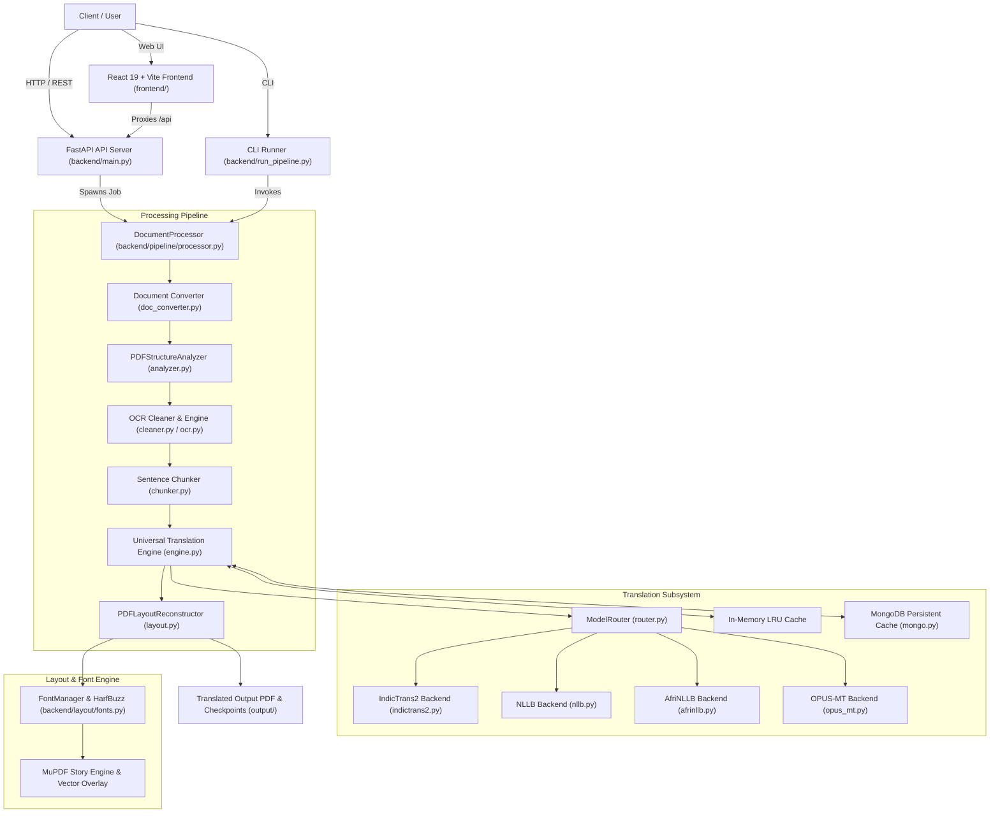

<!-- generated-by: gsd-doc-writer -->
# System Architecture

## System Overview

Nexus is an enterprise-grade, offline-first document understanding, translation, and layout reconstruction engine. The system accepts complex documents (PDFs, DOCX, scanned pages, or images) and produces high-fidelity translated PDFs in 22 Scheduled Indian languages as well as major global languages. Crucially, Nexus preserves the exact visual geometry, typography, tables, and illustrations of the source document using PyMuPDF and HarfBuzz OpenType vector font shaping. The architecture is organized as a modular pipeline combining structural document analysis, OCR cleaning, sentence-level token chunking, batched neural translation with two-tier caching, and geometric layout re-synthesis.

---

## Component Diagram



---

## Data Flow

A typical PDF translation request executes through the following distinct stages:

1. **Ingestion & Format Normalization**:
   - The document is submitted via the REST endpoint (`POST /api/translate`) or the CLI runner (`backend/run_pipeline.py`).
   - If the input is not a native PDF (e.g., DOCX, image), `backend/pipeline/doc_converter.py` converts it to an intermediate standard PDF.

2. **Structural Document Analysis (`PDFStructureAnalyzer`)**:
   - Extracts page dimensions, text spans, vector lines, embedded images, tables, and bounding boxes (`bbox`).
   - Distinguishes body paragraphs from running headers, footers, and page numbers to prevent translation errors on structural markers.
   - Detects whether pages are digital or scanned; triggers OCR rasterization if digital text is absent.

3. **OCR Normalization & Text Cleaning (`TextCleaner`)**:
   - Strips font-substitution artifacts, archaic scanner glyph anomalies, soft-hyphens, and split line-breaks.
   - Performs script validation using Unicode blocks to verify that the declared source language matches the actual text.

4. **Sentence-Aware Chunking (`SentenceChunker`)**:
   - Divides blocks into sentence chunks constrained to the model's token limit (default: 512 tokens).
   - Preserves intra-sentence boundaries and associated visual bounding boxes so translations can be accurately mapped back to the physical page coordinate space.

5. **Neural Translation & Caching (`UniversalTranslationEngine`)**:
   - Checks Tier 1 (in-memory LRU) and Tier 2 (MongoDB `translation_cache`) to avoid recomputing previously translated sentences.
   - If a sentence is not cached, `ModelRouter` inspects the `(src_lang, tgt_lang)` pair and dynamically routes the request:
     - Indic languages: AI4Bharat `IndicTrans2` (1B or distilled 200M/320M)
     - Global languages: Meta `NLLB-200` (1.3B or distilled 600M)
     - African languages: `AfriNLLB`
     - European pairs: Helsinki-NLP `OPUS-MT`
   - Executes batched parallel GPU tensor inference (`float16` on CUDA) with dynamic batch halving to protect against VRAM OOM errors.
   - Persists translated chunks back to both cache tiers.

6. **HarfBuzz Vector Layout Reconstruction (`PDFLayoutReconstructor`)**:
   - Applies precise white redaction over original text spans on the PDF canvas, leaving background artwork, lines, and illustrations intact.
   - Maps the target language to high-quality OpenType Indic/global fonts (`backend/layout/fonts.py`).
   - Employs MuPDF's HarfBuzz Story engine to shape complex consonant conjuncts and matra positions.
   - Dynamically calculates font scaling and bounding box growth into verified empty space to accommodate text expansion (typically 30–60% for Indic translations).

7. **Checkpointing & Delivery**:
   - Periodically checkpoints output documents every 5 pages to `output/` to guarantee data safety during long-running translations.
   - Generates high-resolution rendered previews for the frontend interactive split-view viewer (`GET /api/jobs/{job_id}/pages/{page_num}/rendered`).

---

## Key Abstractions

| Abstraction | File Path | Description |
| :--- | :--- | :--- |
| `DocumentProcessor` | [`backend/pipeline/processor.py`](file:///c:/Users/sangh/Downloads/to%20desktop/nexus/backend/pipeline/processor.py) | Orchestrates the end-to-end multi-page translation pipeline, concurrency slots, and checkpoint persistence. |
| `PDFStructureAnalyzer` | [`backend/pipeline/analyzer.py`](file:///c:/Users/sangh/Downloads/to%20desktop/nexus/backend/pipeline/analyzer.py) | Parses PDF geometries, extracts text blocks, spans, images, drawings, and detects scanned pages. |
| `PDFLayoutReconstructor` | [`backend/pipeline/layout.py`](file:///c:/Users/sangh/Downloads/to%20desktop/nexus/backend/pipeline/layout.py) | Overlays translated text onto the PDF using MuPDF Story and HarfBuzz complex-script vector shaping. |
| `UniversalTranslationEngine`| [`backend/translation/engine.py`](file:///c:/Users/sangh/Downloads/to%20desktop/nexus/backend/translation/engine.py) | Manages model loading, LRU VRAM memory offloading, GPU batch inference, and caching integration. |
| `ModelRouter` | [`backend/translation/router.py`](file:///c:/Users/sangh/Downloads/to%20desktop/nexus/backend/translation/router.py) | Normalizes ISO/Flores language codes and routes language pairs to the optimal offline model backend. |
| `TranslationCache` | [`backend/translation/cache.py`](file:///c:/Users/sangh/Downloads/to%20desktop/nexus/backend/translation/cache.py) | Two-tier cache coordinator offering sub-millisecond in-memory lookups backed by persistent MongoDB storage. |
| `MongoCacheManager` | [`backend/db/mongo.py`](file:///c:/Users/sangh/Downloads/to%20desktop/nexus/backend/db/mongo.py) | Manages MongoDB connection resilience, job state persistence, and automatic in-memory fallback. |
| `FontManager` | [`backend/layout/fonts.py`](file:///c:/Users/sangh/Downloads/to%20desktop/nexus/backend/layout/fonts.py) | Manages script-to-font mappings for Indic, Latin, Cyrillic, and CJK OpenType fonts. |
| `TextCleaner` | [`backend/pipeline/cleaner.py`](file:///c:/Users/sangh/Downloads/to%20desktop/nexus/backend/pipeline/cleaner.py) | Cleans OCR anomalies, font substitutions, soft hyphens, and validates script consistency. |
| `OCRProcessor` | [`backend/pipeline/ocr.py`](file:///c:/Users/sangh/Downloads/to%20desktop/nexus/backend/pipeline/ocr.py) | Handles OCR rasterization and extraction fallback using PaddleOCR, PyTesseract, or MuPDF. |

---

## Directory Structure Rationale

```
nexus/
├── backend/                  # Core Python backend application and pipeline
│   ├── config.py             # Central runtime configuration, paths, and model registries
│   ├── main.py               # FastAPI REST API entry point and background job worker
│   ├── run_pipeline.py       # Standalone CLI translation entry point
│   ├── db/                   # Database interfaces (MongoDB client, job management, fallback)
│   ├── fonts/                # OpenType fonts for Indic and international script shaping
│   ├── layout/               # Font selection, text shaping rules, and typography fitting
│   ├── models/               # Local cache directory storing downloaded offline model weights
│   ├── pipeline/             # Multi-stage PDF processing (analyzer, cleaner, layout, processor, OCR)
│   ├── scripts/              # Model download, checksum validation, and environment verification tools
│   ├── tests/                # Unit test suites and offline router tests
│   ├── translation/          # Neural translation orchestrator, chunker, cache, and backend adapters
│   └── uploads/              # Transient storage for uploaded PDFs and job artifacts
├── frontend/                 # Web interface built with React 19, Vite, and Lucide icons
│   ├── src/                  # React UI components, split-view PDF viewer, and API client
│   ├── package.json          # Frontend dependencies and Vite build scripts
│   └── vite.config.js        # Vite server configuration and backend /api proxy definition
├── docs/                     # Canonical engineering documentation (Architecture, API, Config, etc.)
├── models/                   # Project root model artifacts and optional shared weights
├── output/                   # Generated translated PDFs, checkpoint files, and page preview images
├── testing data/             # Benchmark PDFs, test documents, and sample inputs
├── requirements.txt          # Python package requirements for PyTorch, FastAPI, PyMuPDF, etc.
├── start.bat                 # Robust full-stack orchestrator for Windows
├── stop.bat                  # Clean server shutdown utility for Windows
└── README.md                 # Primary project overview and quick start guide
```
